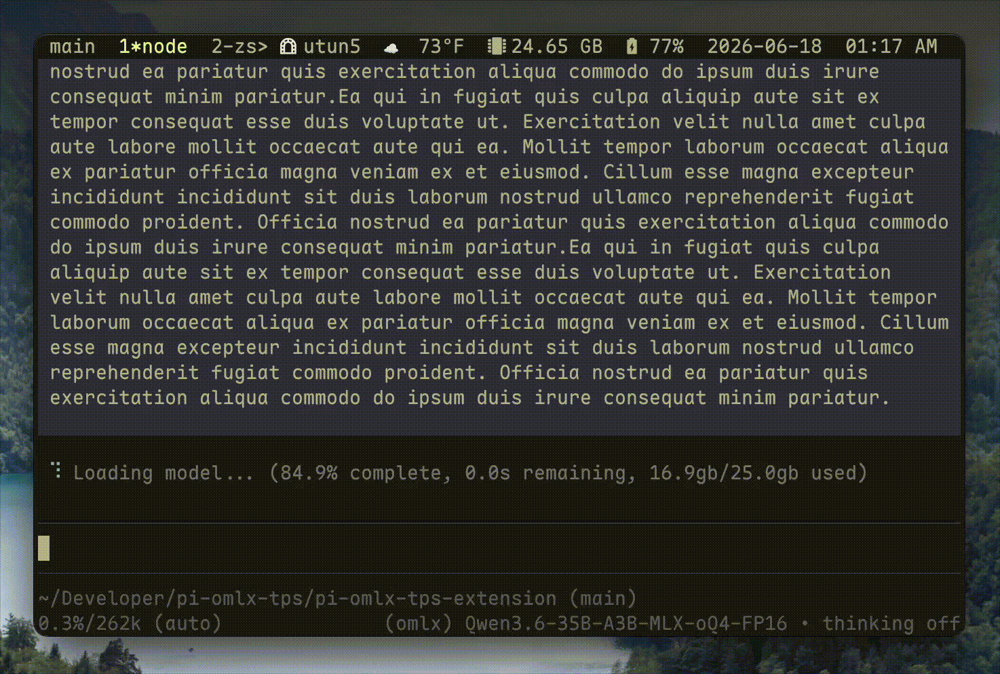
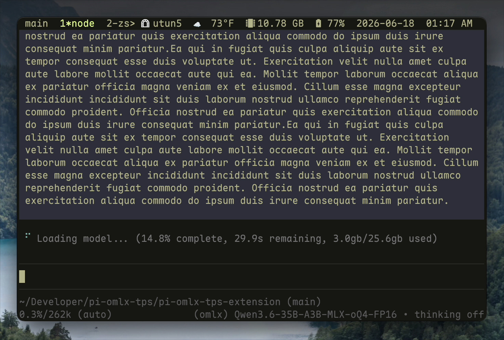
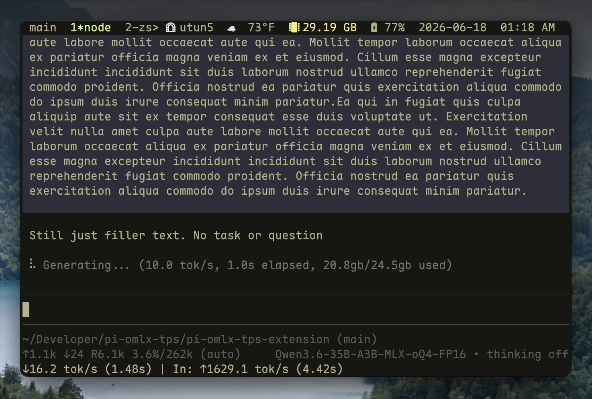

# pi-omlx-tps

This extension is basic and adds [omlx](https://github.com/jundot/omlx) stat reporting using the built in omlx stats endpoint. The goal was to bring the stats given by the webui to the processing prompt.



**Example**:

```sh
 ⠴ Loading model... (17.0% complete, 31.2s remaining, 3.4gb/25.4gb used)
 ⠏ Preparing... (21.2gb/25.7gb used)
 ⠼ Prefilling... (83.7% complete, 31.6s remaining, 22.7gb/25.1gb used)
 ⠸ Generating... (20.0 tok/s, 2.1s elapsed, 20.1gb/25.3gb used)
```

It is reccomended to use [pi-omlx-picker](https://pi.dev/packages/pi-omlx-picker?name=omlx) for omlx model configuration and API key configuration.

The maxmium ram defaults to the hard limit value, not soft. This is not configurable at the moment.

## Install

```sh
# npm
pi install npm:pi-omlx-stats

# git
pi install git:github.com/nathandaven/pi-omlx-tps
```

## Configuration

Below env variables are available (defaults given):

```sh
# Used to create a log file. Log file stored at `/tmp/omlx-tps.log`. Set to 1 to enable.
OMLX_TPS_EXTENSION_DEBUG=
# Omlx base url.
OMLX_BASE_URL="http://127.0.0.1:8000/v1"
# If you have set up an API key for the web ui, set it here.
OMLX_API_KEY=
```

## Screenshots







## License

MIT
